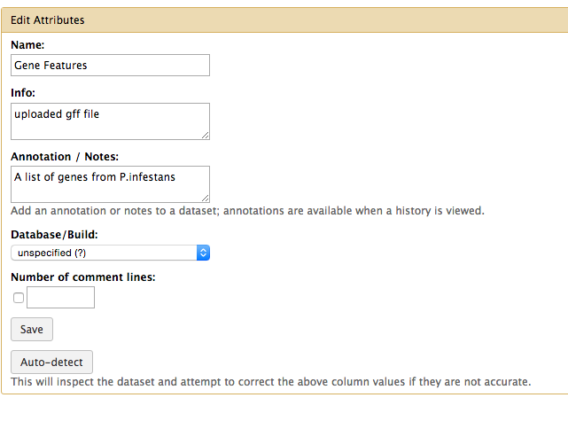

> ## Learning Objectives {.objectives}
>
> * Study the Galaxy Interface
> * Understand the `History` and `Tool` panels
> * Understand how to run tools
>

Once logged into Galaxy, you should see the main Analysis view, which looks like this:

There are 4 areas in this view, they are coloured in below:

1. Tool Panel (left-side, pink box) - which carries the list of tools, under various headings
2. History (right-side, purple box) - which carries the data items that you will work with
3. View Navigator (top, yellow bar) - which allows you to select the current view
4. Main Panel (centre, black-box) - which is where the tool interfaces and data views are shown

Tools are the programs and scripts that we have added to Galaxy that can be used for analyses. Galaxy tools are all kept in the left-hand pane of the analysis view, and are organised into tool categories. At the top you should see the `Get Data` category, for example. Let's look at using a tool in Galaxy.

Let's try getting some data into Galaxy from the outside world.

> ## Challenge {.challenge}
> + Click the `Get Data` heading in the Tool Panel, and the `Upload File` from your computer tool.
> + The tool interface should replace the splash page in the centre panel, and look like this:

> +  The tool's options are now visible and can be selected. This tool has just a few, and are all described in the help at the bottom of the screen.
> +  Select `Choose File` and from the drop-down box select the file `small.gff` (which you can download at this [link](data/small.gff).
> +  Select Execute at the bottom of the tool interface to make the tool run. You should see a helpful message when the tool starts to run.
> +  When the tool is run, and the data are uploaded you should see a green box in the History panel.

History items are the data that Galaxy is using, they live in the history in the order that they were created (lower items = older items) and have a number of attributes.
Each history item is coloured according to state,

+  Green = everything is fine with this data item and it can be used in tools.

+  Yellow = this job is still running.

+  Red = this job has failed and the data item can't be used.

+  Grey = this job is queued and is waiting to run.

History items can be downloaded from the History panel, using the icons in the top right of each History item. The eye icon allows you to preview the file contents in the Main Panel, the disk icon allows you to download the file.
Galaxy History items are never deleted until you explicitly state that they can be, data items, analyses and jobs stay live even after you log-out and shut down the machine.

Clicking on the name of the history item expands it and presents you with summary information and a preview of the data.
We are shown that this example file has 9 lines in it (is the one you uploaded different?), is of format GFF and has database `Arabidopsis`. We can also see that Galaxy has automatically annotated the columns in the file and numbered them.

If Galaxy makes a mistake with any of our history items, such as giving a file the wrong format, we can alter the attributes manually. This is often useful to give the items a useful name. Let's alter the attributes of our `small.gff` history item.
Click the pencil icon in the top-right corner of the history item.
You should see the form in the main panel as below:

> ## Challenge {.challenge}
> +  Alter the contents to reflect those in the picture above.
> +  Click 'Save' and observe the history item update in the History Panel.

Genome sequence can be used within Galaxy, in some Galaxy instances it is installed or 'built-in' by the person who maintains Galaxy, but more often you will want to upload one to the history, using the `Get Data` tool. Other tools that need a reference genome will ask you whether you want to use the history or a 'built-in' or 'build'.

> ## GFF {.callout}
>The file that you uploaded is a GFF file. GFF stands for Generic Feature Format. It is a format that contains on every line, information about a genomic feature such as a gene. It includes information about the Chromosome or Contig a feature is on, the start and end of the feature and the feature's strand. It doesn't contain the nucleotide or protein sequence of the feature.

A common task is to get the nucleotide sequence for a set of features, given the start and end co-ordinates in a genome. Doing this with Galaxy is very straight forward

> ## *fetch the fasta formatted sequence* by *extracting genomic DNA* {.challenge}
> Use Galaxy tools to *fetch the fasta formatted sequence* of the genes represented in the file you uploaded, by *extracting genomic DNA*
> You will need to upload the reference genome, use the `p_infestans_t30-4.fa` file from this [link](data/p_infestans_t30-4.fa).
> You will need to make sure that the type of the History item is GFF
> You will need to work out which tool to use. Have a good look in the Tools Panel and keep in mind the challenge title to find the category and tool you need.
