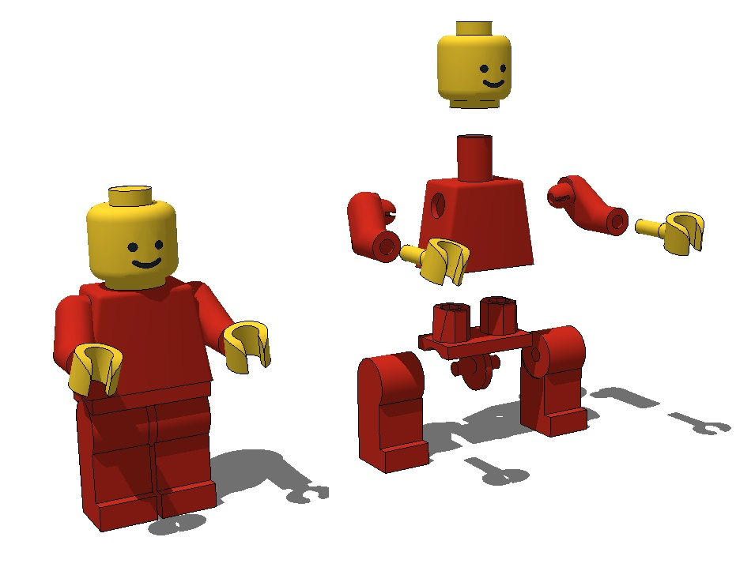
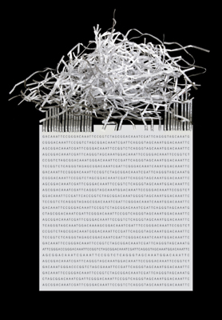

## The parts and how they interact

Genomics is about understanding the recipe book of an organism. There are a lot of aspects to it. But it all boils down to finding out the genes that specify the components of an organism so we can study them either for their own sake or as parts of larger systems.

## Getting the genome is hard

Genomes are messy, horrible things. Every single organism has a different one and we can't just _read_ them. We can read tiny bits with DNA sequencers and try to put them back together, but this is as hard as it sounds. Virtually every genomics project everywhere relies on some sort of genome assembly, whether you have to do your own or you can download one from a previous effort. It's a tough computational problem with lots of pitfalls.

 

## Our objective
This will be the focus of this first session - how to go from raw sequence data to a rough draft genome assembly. We'll do this using common computer programs and sample data from a real pathogen in a graphical user environment - the Galaxy Workflow Interface.