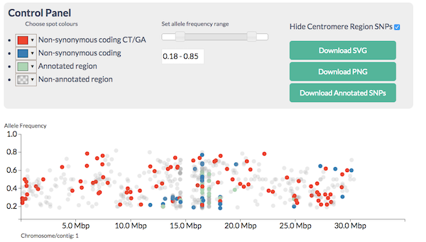
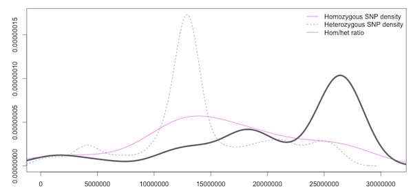

> ## Learning Objectives {.objectives}
> * Understand CandiSNP output
> * Plotting frequencies of SNPs of different types across the chromosome
>

Once we have a list of SNPs that we are happy with and have annotated them with SNPEff, there are a couple of approaches we can take to start finding candidates that may be our causative mutation.

The approach we take will depend on the genetic background. As we discussed at the start, we are generally looking for a region of high homozygous SNPs, but the frequency of other SNPs will depend on the cross. A wide cross from a fairly distant relative (like a different strain or ecotype) as is commonly used in genetic mapping strategies will allow us to make use of the heterozygous SNPs as a control.

Fast interactive visualisations are a great help in finding the recombinant region and narrowing the candidates. One tool that allows us to do this is CandiSNP. CandiSNP is a JavaScript visualisation package that allows interactive filtering and highlighting of SNPs across whole chromosomes (DISCLAIMER: My group wrote this!)

It allows you to look at the SNPs like this:

and apply filters to narrow down the region and candidates so you see this:

CandiSNP takes an annotated VCF file as input.

Statistical methods are useful when the number of SNPs generated is so large that you can't visualise them all at the same time.

Density plots like this one (which is of the same data as the CandiSNP):

help us to see the rough patterns in a similar way. The homozygous and heterozygous show an increase in the SNP-rich centromeric region which biases the data and an overall decrease at the far right of the chromosome, but the enriched region is visible in the high ratio at about 17Mbp as in the CandiSNP output. These kinds of plots can be generated with Galaxy's plotting tools.

>## Centromeres {.callout}
> Centromeres are a real problem with these sorts of analysis. They are so SNP rich that they swamp analysis and visualisations. It helps to just screen them out from the analysis. CandiSNP will let you turn off centromeres associated SNPs, Galaxy tools can also help you filter them out.
>

>## SNP Deletion - Fewer are better {.callout}
> Perhaps counter-intuitively, getting fewer SNPs is often better in these approaches. A common source of confounding SNPs is from the parental line itself. All individuals of any species have differences in the genomes from the references we use to call SNPs, and some (perhaps many) of these will be shared between the parent used to generate the mutants and the mutants. By sequencing the parent line and calling SNPs between it and the reference genome, you get a list of parental SNPs that you can often delete straight out of the mutant as being non-causative.

>## _C.elegans_ and CloudMap {.callout}
>
> Galaxy Team members have also produced a tool for doing this sort of thing. It's called CloudMap and it provides visualisation and plenty of options for finding non-recombinant regions in the backcrossed lines. It helpfully allows you to filter out SNPs that could be candidates, such as EMS induced ones. As far as I can tell, the version available as a Galaxy tool works on _C.elegans_.
>

>## Analyse SNP data with CandiSNP {.challenge}
> You have some whole genome _Arabidopsis_ SNP data annotated with SNPEff in the shared data library `Visualisation`, the VCF file `filtered_snps.vcf`. Use this in the `candisnp` tool in the `TSL SNP Tools` tool set. This data set is a real one and we know exactly where the mutation is because we've sequenced it, so there is a _right_ answer. Use the sliders and filter tools to find a region enriched in homozygous candidate SNPs.
>
>	1. Can you come up with candidate regions / genes for the causative mutation?
>	2. Which is more useful, filtering or colouring?
>	3. How much extra information does knowing the genes give? In this specific training case and in a real case where you might know something about the biology already.
>
