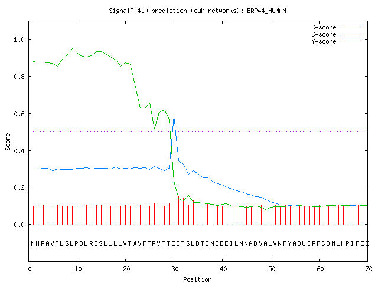

> ## Learning Objectives {.objectives}
>
> * Understand Classification
> * Understand what makes good positive and negative controls
> * Run SignalP and interpret the output
>

Classification is the process of taking an object and deciding whether it falls into a particular group. In this case we will be deciding whether a protein is an effector or not. Classification at its simplest requires some sort of baseline against which to compare our candidate and make a decision so the first step of classification is to create the classifier. Often these classifiers will be data structures embodied in computer programs. The sophistication of these programs varies and their contribution to the accuracy of classification varies too. Most importantly when the program contains its own model we must be aware of how that model can vary from what it is we are looking for. Therefore we need to always apply the best scientific principles of control and criticism when carrying out these analyses, these tools will all give spurious results if we try to use them as a `black-box`.

Appropriate controls are vitally important. In this tutorial you`ll notice that the `right` control is probably a matter of opinion and that the interpretation and results of our analysis can vary hugely dependent on what we are using. As far as possible it is necessary to get a control or control set that has been shown experimentally to be of the class that we are interested in.

Protein secretion is a primary mechanism in the pathogenesis of many prokaryotic and eukaryotic microorganisms. The effector proteins are secreted from the cytosol of the pathogen into the host whereby they cause disease. The molecular signal that marks a protein for export is called the signal peptide and is typically found at the N-terminal of the protein. Thus candidates can be screened by identifying a signal peptide. Signal peptide programs are numerous, SignalP is one of that is frequently used.

> ## Hidden Markov Models {.callout}
> Hidden Markov Models (HMMs) are complex statistical tools that work by calculating the probability of moving from one state to another based on a background model, that is to say from moving from an `L` amino acid to a `D` given the relative proportions of `L`s and `D`s in that point in the set of sequences from which the model was derived. The canonical tool for using and defining HMMs is HMMER. The process of defining a HMM requires a careful alignment of a number of positively identified proteins. HMMs tend to be used for defining short protein domains or motifs. Many methods dealing with sequence use HMMs in one way or another.
>

From the author`s description
~~~
SignalP is a program that we can use to find potential peptide signals. SignalP server predicts the presence and location of signal peptide cleavage sites in amino acid sequences from different organisms: Gram-positive prokaryotes, Gram-negative prokaryotes, and eukaryotes. The method incorporates a prediction of cleavage sites and a signal peptide/non-signal peptide prediction based on a combination of several artificial neural networks and hidden Markov models.
~~~

It is therefore a complex heuristic and its internal models of what constitute a signal peptide may in fact be very different from those that you are interested in, which means that we must examine the output very carefully.

> ## Run SignalP 3.0 {.challenge}
> + Start a new history and from the  `Summer School` data library, load in the data in `Effector Classification`
> + Find the SignalP 3.0 tool under `Protein Analysis`
> + Select your `unclassified.fa` file as the sequences in `Fasta file of protein sequences`
> + Select Eukaryote
> + Select 70 for `Truncate Sequences`
> + Click `Execute`
> + You`ll get a big table as a result, you might find it easier to examine if you copy and paste into Excel.

As you will see from the output SignalP makes a definitive prediction about whether a protein carries a signal peptide or not, however as this is based on its internal model we need to compare some known proteins. Look at the scores and read the SignalP output description in the Galaxy tool window to get a feel for what it is telling you. Here`s SignalP`s own description of the scores:

> ## SignalP scores {.callout}
> The graphical output from SignalP (neural network) comprises three different scores, C, S and Y. Two additional scores are reported in the SignalP output, namely the S-mean and the D-score, but these are only reported as numerical values.
>
>
> + The `S-score` for the signal peptide prediction is reported for every single amino acid position in the submitted sequence, with high scores indicating that the corresponding amino acid is part of a signal peptide, and low scores indicating that the amino acid is part of a mature protein.
>
> + The `C-score` is the `cleavage site` score.
> For each position in the submitted sequence, a C-score is reported, which should only be significantly high at the cleavage site. Confusion is often seen with the position numbering of the cleavage site. When a cleavage site position is referred to by a single number, the number indicates the first residue in the mature protein, meaning that a reported cleavage site between amino acid 26-27 corresponds to that the mature protein starts at (and include) position 27.
>
> + The `Y-max` is a derivative of the C-score combined with the S-score resulting in a better cleavage site prediction than the raw C-score alone.
> The cleavage site is assigned from the Y-score where the slope of the S-score is steep and a significant C-score is found.
>
> The `S-mean` is the average of the S-score, ranging from the N-terminal amino acid to the amino acid assigned with the highest Y-max score, thus the S-mean score is calculated for the length of the predicted signal peptide.
> The S-mean score was in SignalP version 2.0 used as the criteria for discrimination of secretory and non-secretory proteins.
>
> The `D-score` is introduced in SignalP version 3.0 and is implemented as a weighted average of the S-mean and the Y-max scores. The score shows superior discrimination performance of secretory and non-secretory proteins to that of the S-mean score which was used in SignalP version 1 and 2.
>
> For non-secretory proteins all the scores represented in the SignalP output should ideally be very low.

> ## Getting a good result from SignalP {.challenge}
> + Run SignalP on the `avr_proteins.fa` file
>
>  + Compare the values of the scores, in particular the D scores, for the  `avr_proteins.fa` and your unclassified proteins.
> + Can you come up with a convincing threshold that allows you to discriminate the candidate secreted peptides better than the raw SignalP output? Sketch out your ideas for the comparison.

> ## Manipulating text and tables in Galaxy {.callout}
> Galaxy is designed to work with text and tabular data, a lot of its tools perform useful actions on these types of files. In particular the tools in the categories below:
>
> + Text Manipulation
> + Filter and Sort
> + Join, Subtract and Group
>
> are all very useful for making subsets of results and combining them with others. We won`t go through them in too much detail in this document, they are pretty self-explanatory, but they are useful if you want to automate the challenge above.
